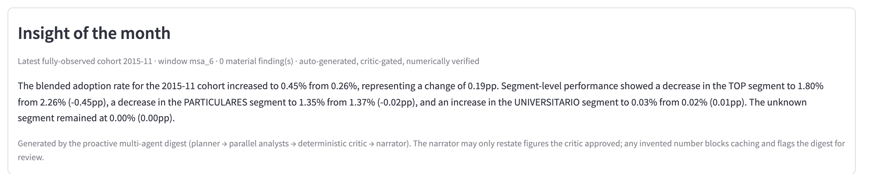
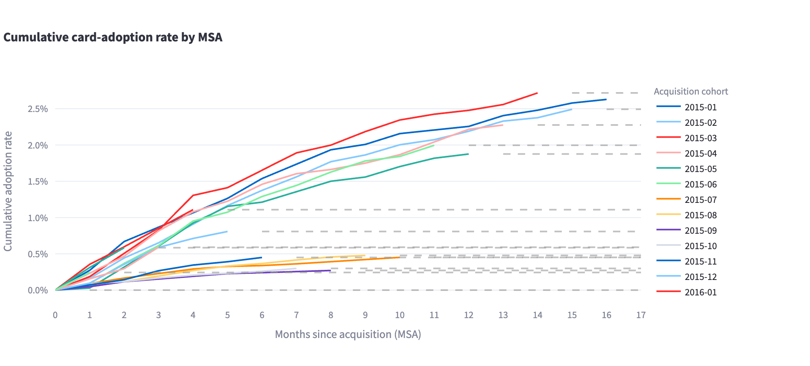
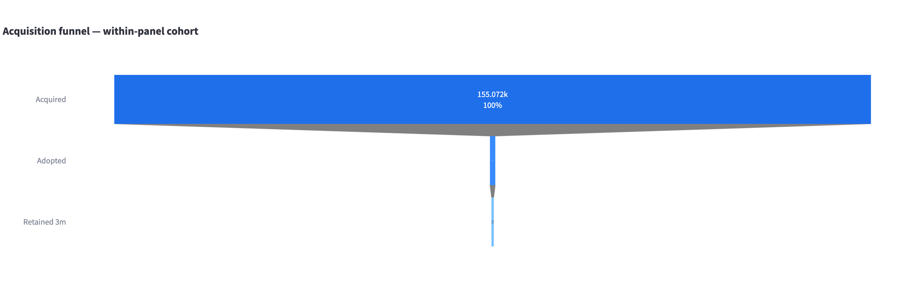
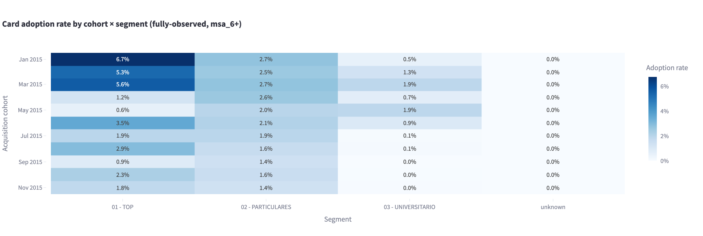

# Card-Acquisition Funnel

A **proactive, self-directing multi-agent funnel-analytics system with a built-in
data-honesty gate** — built on a credit-card acquisition → adoption → retention funnel
(BigQuery + dbt governed semantic layer + Gemini/ADK copilot + Streamlit + Cloud Run
scale-to-zero + Terraform).

The funnel and vintage analytics are the substrate. The proactive multi-agent layer with
its deterministic critic is the star.

**Live demo:** _(coming Phase 4)_

---

## What Makes This Different from Cockpit #1

This project shares ~80% of the stack with
[credit-risk-cockpit](https://github.com/mativazques/credit-risk-cockpit) — deliberately.
The story is "I can apply the same governed-metric pattern to a different domain and defend
both." But the analytical and agentic layers here are genuinely distinct:

1. **A proactive, multi-agent insight layer.** Flagship #1 is purely reactive Q&A. This
   project pushes the month's insights and early-warning flags without being asked, via an
   ADK multi-agent pipeline with a **critic agent that enforces the data-honesty contract
   via deterministic Python guards, not LLM judgment.** This is the primary differentiator.

2. **Multi-stage funnel with stage-to-stage conversion** (acquired → adopted → retained)
   — a waterfall view flagship #1 lacks.

3. **Behavioral adoption over time** — a real vintage curve of credit-card adoption by
   months-since-acquisition, the cohort machinery of #1 applied to onboarding instead of
   defaults.

**Why multi-agent?** Two honest reasons:

- **Parallel decomposition.** "Analyze the whole funnel and tell me what matters" is open-
  ended: which cohorts, which segments, which deltas are material? Decomposing this across
  parallel Analyst agents (cohort-over-cohort, by-segment, retention, time-to-adoption)
  mirrors how a human analyst team divides the work and runs the slices in parallel.
- **Auditable separation of responsibilities.** Planner → Analyst agents → Critic →
  Narrator. The Narrator never sees raw analyst outputs — it sees only what the Critic
  approved. That structural constraint cannot be achieved with a single agent plus a
  validation prompt.

The **reactive** Q&A path deliberately stays single-agent: one question, one retrieval,
one answer. Multi-agent there would be gratuitous. Knowing _when not to use_ multi-agent
is part of the skill shown here.

---

## Scope Boundary

> **Real, observed data covers:** customer acquired (`fecha_alta`, a real calendar date) →
> credit-card adopted (`ind_tjcr_fin_ult1` flips 0→1, a real observed event) → retained
> (flag persists in later monthly snapshots).
> **NOT in this data (and NOT claimed):** there is **no application or approval/rejection
> stage** — every customer in the Santander dataset is already an account holder, so this is
> an **adoption/cross-sell funnel, not an approval funnel**. There is **no marketing
> top-of-funnel** (impression/click/spend). The acquisition **channel** (`canal_entrada`)
> is a real CRM field but its values are **obfuscated 3-letter codes** — presented as
> "acquisition-channel segments", never relabeled "web/branch/telesales" (that would be
> inventing labels). No synthetic data is used; the honesty comes from reframing to what the
> data actually observes.

---

## The Pitch

A growth/acquisition analyst opens the cockpit and the copilot has **already** written the
latest cohort's insight — _"the Feb-acquired cohort's 6-month card-adoption rate is 6 pp
below Jan; the drop concentrates in the mid-income segment"_ — flagged as an early warning,
narrated from the same governed metrics the BI charts use. No question needed.

---

## Screenshots

_(Phase 4 — placeholders below)_

**Proactive insight panel** — the monthly digest and early-warning flags for the latest
fully-observed cohort, pre-generated by Airflow, served at $0.



**Adoption vintage curves** — cumulative card-adoption rate by months-since-acquisition,
one line per acquisition cohort. Right-censored points suppressed by the deterministic
critic guard.



**Funnel waterfall** — acquired → adopted → retained conversion at the cohort level.



**Cohort x segment heatmap** — adoption rate by acquisition cohort and customer segment.



---

## Architecture

```
                ┌──── Airflow (LOCAL Astro/Docker — NOT Cloud Composer) ────┐
                │  ingest → dbt run → dbt test → GENERATE MONTHLY DIGEST     │
                │  (Cosmos: each dbt model a task) (multi-agent, cached)     │
                └──────────────────────────┬────────────────────────────────┘
                                           ▼
Santander CSV → GCS (raw) → BigQuery (raw)
                          → dbt (staging → intermediate → marts + semantic layer)
                          → Streamlit  (cockpit: funnel + curves + heatmap + insight panel + chat)
                          → FastAPI + Gemini (AI Studio free · Vertex prod) + ADK + MCP  (copilot)
                          → Cloud Run (deploy, min-instances=0)   ·   Terraform (IaC)
```

**Multi-agent pipeline (Google ADK — self-hosted, non-gratuitous):**

```
Orchestrator (planner)   → picks which cohorts / metrics / segments to investigate
      │
      ├─ Analyst agents (parallel) → each calls the GOVERNED tools for one slice
      │                              (cohort-over-cohort, by-segment, retention, tta)
      ▼
  Critic agent            → DETERMINISTIC PRE-FILTER (Python/SQL checks, not LLM judgment)
      │                      (a) right-censoring suppression via dbt flags
      │                      (b) min-n guard: suppress cells with cohort_size < 50
      │                      (c) materiality gate: abs(delta) >= 2pp AND > 1.5 x rolling_SD
      ▼
  Narrator (synthesizer)  → writes the digest + early-warning flags
                            (receives ONLY the critic's output struct — never raw analyst outputs)
```

**Digest cache:** pre-generated in Airflow after `dbt test`, stored in `mart_digest_cache`
(BigQuery), keyed by `(cohort_month, dbt_run_id)`. Streamlit reads the stored digest —
zero LLM tokens on page load.

**Airflow is local Astro/Docker** (Cloud Composer ~USD 300–400/mo would break the $0
target). The monthly-digest generation is an Airflow task after `dbt test`.

**Deploy shape:** one scale-to-zero Cloud Run container (`min-instances=0`). Terraform
owns only the serving layer; the data layer is left as bootstrapped so IaC cannot destroy
loaded data.

---

## dbt Dimensional Model

| Layer | Models | Materialization |
|---|---|---|
| Staging | `stg_customer_month` | view |
| Intermediate | `int_customer_adoption_resolved` | ephemeral |
| Facts | `fct_customer`, `fct_customer_month` | table (partitioned + clustered) |
| Dims | `dim_customer`, `dim_date`, `dim_channel` | table |
| Marts | `mart_adoption_curves`, `mart_cohort_adoption`, `mart_digest_cache` | table |

`fct_customer_month` is a **TABLE** (not a VIEW), partitioned by
`DATE_TRUNC(snapshot_month, MONTH)` and clustered by `acq_month, segmento`. The
~13M-row Santander panel makes a VIEW unacceptable for a live cockpit (3–8 s scan per
query). Storage ~1–2 GB, within BigQuery's 10 GB/month free tier.

**Governed semantic layer** — four tools consumed identically by BI and agents:
`list_metrics`, `query_metric`, `compare_cohorts`, `explain_metric`. Text-to-metric end to
end; never raw text-to-SQL.

**Fully-observed window = 6 months (primary).** A cohort is fully observed at msa_6 when
`acq_month + 6 months <= May 2016`. ~11 cohorts qualify. msa_12 leaves only ~5 early-2015
cohorts — available but labeled "limited cohort pool."

---

## Stack

Python · SQL · BigQuery · dbt · Airflow (Astro + Cosmos) · FastAPI · Gemini (AI Studio /
Vertex AI) · ADK · MCP · Streamlit · Cloud Run · GCP · Terraform

---

## How to Run

### Prerequisites

- A free [Kaggle account](https://www.kaggle.com) → *Account → Create New Token* for
  `KAGGLE_USERNAME` / `KAGGLE_KEY`.
- **Accept the competition rules** at
  [kaggle.com/c/santander-product-recommendation](https://www.kaggle.com/c/santander-product-recommendation)
  under your Kaggle account before downloading. The script requires this; raw data is never
  committed.
- A GCP project on `matirvazques@gmail.com`, with BigQuery and Cloud Storage APIs enabled.
  Create the GCS bucket and BigQuery dataset in a **US region** to stay inside the Always-
  Free tiers.
- `cp .env.example .env` and fill in the values.

### Venv setup

The stack needs isolated venvs because of conflicting protobuf pins (same pattern as #1):

```bash
python3    -m venv .venv         && .venv/bin/pip install -r dbt/requirements.txt
python3    -m venv .venv-app     && .venv-app/bin/pip install -r app/requirements.txt
python3    -m venv .venv-copilot && .venv-copilot/bin/pip install -r copilot/requirements.txt
python3.12 -m venv .venv-mcp    && .venv-mcp/bin/pip install -r copilot/requirements-mcp.txt
```

### Phase 0 — Ingestion (Kaggle competition → GCS → BigQuery)

The ingestion script downloads `train_ver2.csv` from the Santander competition, unzips it,
uploads to GCS, and loads to BigQuery with `WRITE_TRUNCATE`. Idempotent: skips the Kaggle
download if the GCS object already exists.

**Recommended — [Google Cloud Shell](https://shell.cloud.google.com)** (free; keeps the
~700 MB zip off your laptop):

```bash
git clone https://github.com/mativazques/card-acquisition-funnel && cd card-acquisition-funnel
pip install -r scripts/requirements.txt
cp .env.example .env   # then edit .env
python scripts/ingest.py
```

Or run locally with the same commands. Or:

```bash
make hydrate   # ingestion + dbt build + test in one shot
```

### Phase 1–2 — dbt + semantic layer

```bash
make dbt-build        # run + test the whole DAG in lineage order
make dbt-docs         # generate the dbt docs site
make airflow-start    # local Airflow (Astro + Cosmos) — needs Docker
```

### Phase 3 — Copilot + proactive multi-agent digest

```bash
make api              # FastAPI + Gemini copilot on :8000
make app              # Streamlit cockpit on :8501
```

### Phase 4 — Deploy

```bash
make tf-bootstrap     # Artifact Registry + secret + enable APIs
make secret-push      # push GEMINI_API_KEY into Secret Manager
make image-push       # build linux/amd64 + push to Artifact Registry
make deploy           # terraform apply Cloud Run service; prints URL
make trim             # drop raw GCS + BQ raw table (keep marts)
make teardown         # destroy serving layer (data layer kept)
```

---

## Cost Controls

- **Cloud Run `min-instances=0`** → $0 idle.
- **ADK self-hosted** in the Cloud Run container (NOT Vertex Agent Engine — it bills per
  vCPU-hour even idle).
- **Gemini AI Studio free tier** — 1,500 req/day hard $0 ceiling, no billing kill-switch.
- **Digest pre-generated + cached** — a handful of LLM calls once per cohort-month, well
  within the free tier. Zero tokens at serve-time.
- **`@st.cache_data`** on all BigQuery reads.
- **`fct_customer_month` as a TABLE** → BigQuery scans the partition rather than the full
  13M-row panel on every query.
- Raw CSV never committed. `make hydrate`/`trim`/`teardown` for ephemeral data lifecycle.

---

## Honesty Footer

- **Dataset:** Santander Product Recommendation (Kaggle competition, 2016), ~13.6M monthly
  customer snapshots (Jan 2015–May 2016), released by Banco Santander, S.A.
- **Access:** raw data NOT redistributed; reproduce via
  `kaggle competitions download -c santander-product-recommendation` after accepting the
  competition rules.
- **Licence:** competition-use data, no open CC/ODbL licence; used for
  non-commercial/educational/portfolio purposes only, consistent with Kaggle's
  academic-research-and-education carve-out; no raw data committed, only aggregated
  non-recoverable outputs.
- **Funnel scope:** acquisition → card adoption → retention; NO application/approval stage
  (every customer is already an account holder); `canal_entrada` channel codes obfuscated,
  presented as segments, never relabeled.
- All ROI/business-case numbers illustrative with stated assumptions; no proprietary systems
  or any employer represented.
